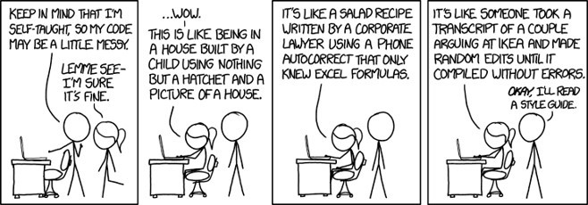
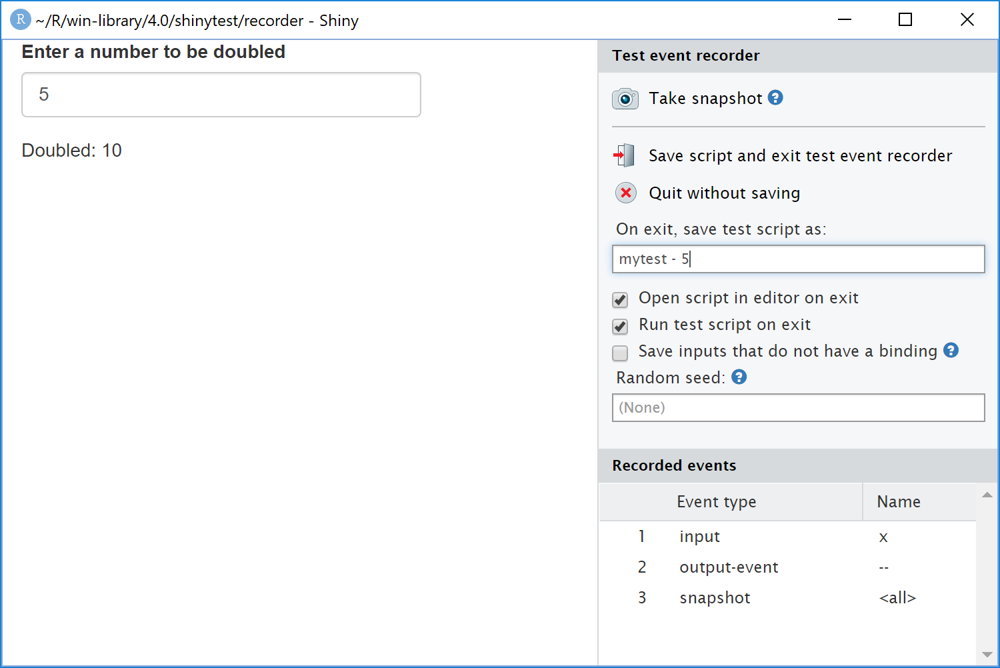
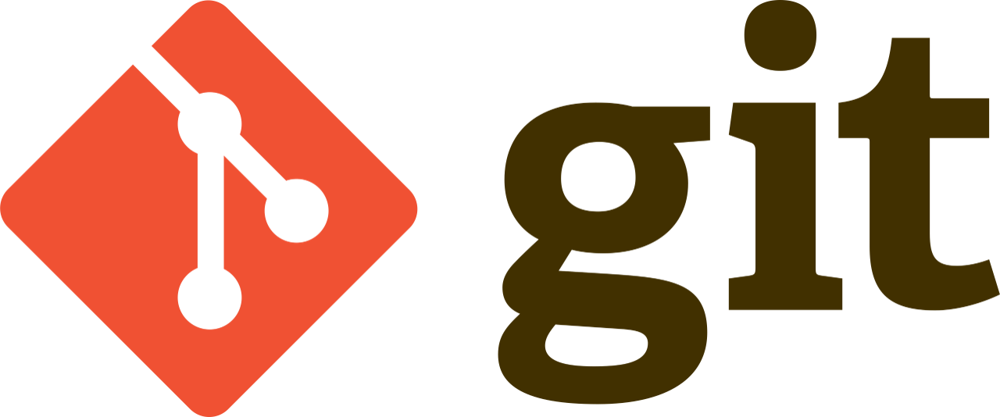
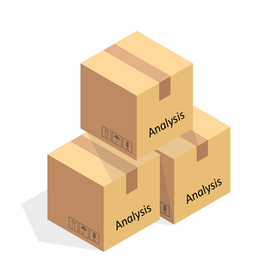

# Introduction

:::: {.infoboxblue .info data-latex="info"}

Want to download a PDF version of this documentation? Click the PDF symbol at the top of this page: 

::::

## Who is this guide for?
This guide has been compiled to support programmers within the Department for Education to write better code that facilitates QA.  If you're an experienced programmer, you shouldn't find anything new here but if you're a less experienced programmer and/or new to DfE, this guide should enable you to embed good code practice into your work.

This guide complements the Analytical Function [Quality Assurance of Code for Analysis and Research](https://best-practice-and-impact.github.io/qa-of-code-guidance).

It is split into several parts; chapters two to four cover the fundamentals of writing good code and maintaining a clear code structure, whilst chapters five to eight cover testing, version control and documentation and have more focus on quality assuring code.  Throughout, the focus is on the R programming language but the principles mentioned in this guide are language agnostic.

## Writing code for QA

There are 4 main aspects to writing high-quality code: 

1. maintaining a clear code structure
2. testing throughout
3. having excellent version control and 
4. providing sufficient documentation

These ways of working broadly map to 3 of the 5 pillars described by the DfE QA framework, namely **Governance and Documentation**, **Clarity and structure** and **Verification**.  In particular, if implemented well, this guide will assist you in meeting good standards of clarity and structure and verification for the DfE QA framework.

:::: {.infoboxyellow .question data-latex="question"}

The [DfE QA framework](https://assets.publishing.service.gov.uk/government/uploads/system/uploads/attachment_data/file/878616/Principles_of_QA_for_analysis.pdf) was introduced in April 2019.
The framework sets consistent standards of quality assurance across analytical work; whether data analysis, modelling, dashboard production, social research or production of Official Statistics. 

::::

## Our approach to writing and updating this guidance

Our thinking has been informed by the basic principles of software development, while acknowledging that the scale of coding activity in the Department is typically small and often involves just a single individual coder. Formal software development tools are likely to be overly burdensome for many (but not all) projects, and we choose instead to use the simple three-stage framework of “design – develop – test” as our model here. Along with this goes the working rule-of-thumb that the time spent producing working code should be divided equally amongst the three stages.

The first version of this guide was written by Kester Jarvis, Niall Taylor and Remi Vergnon.  It is intended to be a living document and we'd very much welcome suggestions for improvements or additions.  Please contact the [Modelling Improvement and Assurance Unit](mailto:modellingandqa@Educationgovuk.onmicrosoft.com?subject=Good%20coding%20practice) or raise an issue on [Git](https://github.com/dfe-analytical-services/good-code-practice). These will be reviewed by the DfE QA Working Group and any approved changes will be made.

<center>



</center>

<!--chapter:end:index.Rmd-->

# The fundamentals of writing good code

Writing good code - code that can be easily understood, used, maintained and modified – is vital. The requirement for better, more robust models and reliable data analysis that meet our emerging quality assurance expectations is intensifying. At the same time, the growing toolkit of data science techniques is creating exciting opportunities for Government analysts to explore new methodologies and software, along with an expanding choice of coding platforms to work within.

Whilst there is plenty of guidance on writing good code, it’s rather piecemeal and it can be very varied. This guidance aims to provide a single consistent narrative and bring together best practice, [links](#links) and further reading to support our analysts in our fast-changing world.  It is all too easy to manufacture working code that does the job but is unintelligible even to its author within a few days. We do acknowledge that there is no single way to write great code but there are common principles that when used will always help you write good code. 

<center>


</center>

## Why writing good code is so important

When embarking on a coding task it can be very easy to focus on a single immediate goal – making something that works now. But there are others who will need to use your code, and who may have different priorities. They include:

* A fellow analyst who needs to quality assure (QA) the code to make sure it’s doing what’s intended
*	A colleague who wants to run your code on a different machine
*	Your future self, who needs to come back to reuse, and perhaps alter, the code in future (you will be surprised by how quickly you forget what you did)
*	A new team member who needs to continue using and building on your code if/when you move on from your role

For all of these people, code needs to be:

* easy to read,
*	easy to understand, and
*	easy to modify.

These should be your key considerations when writing code. You might be sure your code works, but if it’s difficult for someone else to verify that it works, or to reuse and adapt it in future, then...well, it’s not _completely_ useless, but it’s pretty close.

Good coding practice is therefore about ensuring that any code, written for any purpose, is easy to read and understand, is easily shared between analysts, and is straightforward to QA. It aims to avoid wasted time and error, as well as helping to “de-mystify” coding to those who are new to the skill.

:::: {.infoboxblue .info data-latex="info"}

By utilising and promoting the principles of good coding practice the Department can face a changing and developing world of analysis in confidence:

*	Quality assurance can be quick and effective – _good code is easy to understand_
*	Staff turnover needn’t waste time – _good code is easy to use_
*	Changing policies will not require model rebuilds – _good code is easy to maintain_
*	New models do not need to start from scratch – _good code is easy to modify_ 

::::

<!--chapter:end:01-intro.Rmd-->

# Fundamentals:  How to write good code{#fundamentals}

There are no hard and fast rules for how to design good code. Much will depend on the task in hand, the coding platform chosen, and the preferences of the individual. But experienced coders have learnt what works well, and some of the pitfalls to avoid, when preparing to write code. The guidelines below set out to capture that experience as a series of individual tips and advice.

**Use comments judiciously throughout your code**  
They can and should be used to frame distinct sections within your work, to signpost the flow of the work, to clarify choices (e.g. of methodology), and to explain _why_ you have done what you have done (the “what” is usually pretty obvious from the coding itself). For example, you may be excluding all teachers under the age of 25: this will be obvious in the code itself but your comments should explain _why_ this group of teachers is not of interest (e.g. they are likely to lack experience). There’s no good excuse for not commenting your code, and both you and others will reap the benefits when you do. A simple header is a useful way of capturing essential contextual information about the purpose of the code. Without, it may be difficult (or impossible) to identify the purpose of the code and why it was written.  Commenting your code is a key component within the **documentation** pillar of the QA framework and is covered in more detail in the [documentation](#documentation) section.

**Give your variables descriptive names**  
There is very little to be gained by using obscure variable names (e.g. x1, a). Choose variable names that reflect the role of the variable in your work (and the same for functions and subqueries). Most coding languages support numerous naming conventions (some of them are discussed in [chapter 4](#good)) and none is inherently better than any other. Choose one you are comfortable with – and use it _consistently_. This will go a long way to making your code easier to read and assure.

**Avoid embedding constants and literals (“hard-coded” values) within the body of your code**  
This is most relevant when building models with parameters that could potentially be changed on subsequent runs. Ideally there should be a dedicated section at the top of the code which declares variables (data-typing where necessary) and initialises them – this allows others to see at glance the numerical assumptions and definitions your code employs.

**Shorter is not necessarily better**  
Writing a few lines of very compact, dense, convoluted code might seem efficient and demonstrate your prowess in the language but it is generally better to write more lines of clear, simple code that are easy to understand. Avoid using multiple levels of nested code whenever possible too.

**Resource and prepare the input data**  
It is unlikely that the data you need as input is in a format that is immediately useful. Decide the scope of the data you need and make an extract accordingly: don’t just pull a whole data table into your code when you only need a small part of it.

**Be clear about your aims**  
Ensure that you understand fully what your code has to achieve. Talk with your customer or other stakeholders to get a good sense of what they are expecting. Ask them about the level of detail they are seeking, the available data resources, the assumptions they are prepared to make, the output they require, and the timeframe for the work.

**Think about the programming environment you want to work in**  
Familiarity with language is just one factor, but it should not be the only one. Other issues to think about are the current location of input data, the size of any data sets you need to use, and the scale/dimension of the task. Consider what you will need to produce as output and how you (and your customers) will visualise this.

**Choose the best methodology for the task**  
You are likely to have a number of alternative algorithms or approaches to choose from. A good rule here is to “keep it simple” and choose the least complex of these: this may be enough for your purposes. If your code is well written, it is often relatively easy to upgrade to a more sophisticated approach should the need arise.

**Think about how you will structure the work your code will do**  
Break down the task into smaller, manageable tasks that fulfil a well-defined logical role. You should aim to have clear view of the tasks involved, and their ordering, well before you even think about writing your first line of code. Capture your design in whatever way you find most useful: a simple flowchart or some pseudo-code is generally all you need.

**Reflect your chosen structure in the coding**  
For simple programs there will be a natural “flow” to the code which can be read in linear fashion from “start to finish” like the chapters in a book. More complex programs will include conditional branching or the use of supporting subqueries and/or functions, and in this case the program flow is less obvious. Use of devices such as partitioning and commenting help set out the logical flow of your code.  You can read about this in more detail [here](#code_structure).

**Do not worry too much about optimising your code at the start**  
Your goal should be to write code that is easy to read, maintain and update as this will generally be more cost-effective in the long run (in terms of analyst time) than making marginal gains from a slightly faster running time.

**Don’t get too hung up refining the initial design of your program**  
You will not be able to foresee every requirement or decide every detail upfront and trying to do this will simply hold up progress. As you start to code, you will almost inevitably encounter new requirements, or find ways of reducing complexity, that require you to revise your initial plans. Just remember that iteration is a natural part of the development process.

**Avoid repetition where possible**  
It can be tempting to simply “cut and paste” sections of code when there’s a need to do similar work: this is not good practice. Look instead for the _commonalities_ and decide if they could be exploited through writing a function or subroutine, or perhaps by some form of looping structure. Not only will this make your code neater and shorter, but it will reduce the risk of errors proliferating.

**Don’t reinvent existing solutions**  
Reuse existing solutions whenever possible, especially where they have already been quality assured. Ask colleagues who might have done something similar already and who can share existing code for a function or procedure. Don’t be afraid to explore online for new features of your chosen language - this can often save considerable effort. Some languages (e.g. R) make extensive use of online libraries of open source code: this is ideal but don’t just treat their contents as black boxes – make sure you understand what they do and how (not least as this will generally improve your own coding capabilities).

**Delete unnecessary code**  
It is always quite tempting to leave an extra section of code in place which has useful “stuff” in it, even though you have since devised a better way of coding the task. Try to avoid doing this as it will only distract or confuse other readers.

**Refactor your code if you need**  
If you know (a part of) your code is not well structured or presented - or you can see a better way to tackle the issue - then work to improve it straight away. Don’t leave it until later as it will be harder once you’ve forgotten the nature of the task.  It’s not wasted work as it improves the quality of the product and facilitates the QA process.

**Practice version control**  
Over time you will tweak, change or refactor your code. It’s important to clearly document these changes, and ensure that older versions of the code are still available, especially if they were used to produce outputs. For every output from a coding project, it should be clear which version of the data and which version of your code was used to produce it, and you should be able to quickly reproduce that output if required. Tools such as Git are available to help you manage this process, but even without these tools you should strive to follow the same principles.  We cover this in more detail [here](#VC).  

**Testing**  
Testing that your code works is something that should be considered at all stages of the writing process. Each function or small chunk of code that you write will have some expected outputs given certain inputs – check that those outputs are what you expect them to be. You should try to test as you write, which flags up problems early and so avoids issues later down the line. Don’t just test at the end.  We cover this in much more detail [here](#testing).

<!--chapter:end:02-how_to_write_good_code.Rmd-->

# Fundamentals: What good code looks like{#good}

There is no definitive style that determines if code is well written or not. There's an excellent resource for styling R code [here](https://style.tidyverse.org/index.html) and it's worth noting that Rstudio comes with numerous functionalities designed to help with good code structure (see drop down menu in `Code`). But, there are several features that are consistently found in code, regardless of language, that follow the principles of good practice.  Some of these are outlined in the examples below. 
  
## A clear and informative Header
A header should contain, at a minimum, enough information about the code to give the reader an understanding of the task the code is attempting to carry out. It should contain the details of the original author, as well as any subsequent authors, and the dates of any key events – such as the creation date, or the date of a major modification. Headers can also contain information about data sources, libraries or packages (including version) used, or notes on any assumptions that are made in the analysis.  If you're using [Version Control](#VC) software, some of this information may be captured automatically though.

```
  # VIRTUAL COHORT Propensity Score Matching ANALYSIS – 2014 KS2	
  #
  # Written by:  Anne Analyst
  # On:		   26/11/19
  # Last update: 31/12/19
  #
  # Aim:
  #  Using pupil characteristics to identify pupils in LA-maintained schools 
  #  that are similar to pupils in sponsored academies – here “similar” 
  #  means, “have a high propensity to be” – to do this analysis we will use
  #  Propensity Score Matching.
  #
  # Datasets: 2019 KS2 Data
  #	This data has been constructed from various datasets on our SQL
  #	server (school census, NPD, AcademiesAndSchoolOrganisation)
  #
  # Key Libraries:
  #  The PSM analysis uses the MatchIt library – Version 2.4-21
  #
  /////----------------------------------------------------------------\\\\\
  \\\\\----------------------------------------------------------------/////
```

## Consistent use of indentation
Indentation is an important mechanism that adds _structure and readability_ to code. Just like you would use grammar – sentences and paragraphs – to improve the readability of your written communication, you can use indentation to improve your code. A large block of code with no structure is as unreadable as a large block of prose in a novel. (Note that in some languages [e.g. Python] indentation also has a functional purpose – your code will not run correctly if you do not get it right.)

Indentation allows the programmer to delineate which part of code a statement belongs to – for example, any code that is encapsulated by an If statement can be clearly marked by indenting the code:

```
IF (condition is TRUE) THEN
		actions…
    …

    IF (condition2 is TRUE) THEN
		  second set of actions…
      …
    END IF
END IF

```

## Descriptive use of variable names
Variable names should be short but descriptive. E.g. _x1_ is not really helpful in interpreting the role of the variable, but _AverageAgeMale_ is much more helpful if the task is about looking at population dynamics. Use names that link with the subject matter of the task. 

Generally, variable names should be nouns and functions names should be verbs. This isn’t always an easy thing to do!

Try to avoid using names that are already used in standard functions such as the ```mean()``` function in R. 

Choose a consistent naming convention and stick with it: never mix your conventions.
There are several naming conventions in use, including:

*	Use lowercase letters and separate words with underscores (called “Snake case”). E.g. ```country_of_birth```
* Use lowercase letters and separate words with hyphens (called “Kebab case”). E.g. ```country-of-birth```
*	Use uppercase letters at the start of each word (called “Pascal case”). E.g. ```CountryOfBirth```
* Use uppercase letters following the first word (called "Camel Case"). E.g. ```countryOfBirth```
*	In certain languages, you can use spaces as separators and brackets as delineators, e.g. ```[Country of Birth]```
But, it's important to note that spaces can lead to issues in some instances so be sure this convention is appropriate to the software you are using before you start.  For example, you can do this in R, but you can't reference the object in a function.

No one is better than any other – the point is to choose one and use it _consistently_ in your code. If you are modifying someone else’s code that has already established a convention, _stick to that convention_, even if it isn’t the one you’d usually choose.

## Descriptive and informative comments
Use comments to explain the “why”. The “what” and “how” are usually implied by the code itself. An example of well commented code is given below, the comments explain the reasoning behind each operation and allow the reader to understand the context and purpose of the code.

```
# We need to identify which pupils are eligible for free school meals
#  so we create an FSM_flag that we can filter on. 
filtered_pupils <- mutate(total_pupils,
                          FSM_flag = ifelse(earnings <= criteria,
                                            1,
                                            0)) %>%
	# We’re only interested in those pupils who are on working tax
	#  credits and have an FSM flag
		            filter(benefit == “WTC”, FSM_flag == 1) %>%

	# The previous operations re-ordered our table so we need to 
	#  rearrange
		            arrange(age, academic_year)
		
# We want to put our table in a wide format so that we can plot 
#  some nice outputs
	                pupils_wide <- spread(filtered_pupils, academic_year, benefit)
```

## A clear flow and structure
Structure code in a logical order – if you can, break your code into chunks. This can make it much easier to follow. Try not to jump around when manipulating different variables/tables – do your data manipulation on one object and then move onto the next; merge and combine objects at a sensible time.

Strive to limit your code to a reasonable number of characters per line. Doing this means your code is easily readable on one page (remember that others may be working with a smaller view window than you), without the need for scrolling, and it can help to identify different input variables within nested functions.

It may be useful to use commented lines, with no text, to break up your file into easily readable chunks.

There's even more detail on structure [here](#code_structure), and a good example of well-structured code is given below. 
The script is split into 3 sections and clearly broken up.

```
# 1. Input variables ---------------------------------------------------
# =====================================================================-

# Input the folder name of outputs
folder <- “2019-08-12”

# 2. Load data --------------------------------------------------------
# ====================================================================-
	
# Load the rates from the folder
	rates <- read.csv(paste0(“Model_outputs/”, folder),
			      row.names = 1)

# Load regional codes
	regions <- read.csv(“Inputs/Regional_codes.csv”)

# 3. Manipulate -------------------------------------------------------
# ====================================================================-

# Bind regional codes to rates
	regional_rates <- merge(rates, regions)
```

## Consistent spacing
Use white space around code lines and operators. White space around code lines helps to break up the code into readable chunks (see previous section on flow and structure).

Most operators (==, +, -, <-, etc.) should always be surrounded by spaces. 

Place a space before and after () when used with ```if```, ```for``` or ```while``` but never inside or outside parentheses of normal functions. Always put a white space after a comma, never before, just like in regular English.

An example of using spaces in the situations discussed above is given below:
```
# We want to slice a data table for an example to show the use of commas
fruit_table <- food_table[2, 2:6]

# This is a generic if statement
if (fruit == “Orange”) {
	oranges <- crates * crate_stock - wastage
	}
```

## If required, the use of functions or subroutines
You shouldn’t be repeatedly writing the same code: if you find yourself doing this, stop! It’s much more efficient to create a function or subroutine instead. By doing this you only need to quality assure the function once, rather than your repetitive code many times. It also means that any future changes need to be implemented only in one place rather than many, and can be more efficient for the code to run. 
```
# Create a function for calculating the weighted average
weight_avg <- function(year, year_grp) {
	
  # Arguments:
  #  year – academic year we’re interested in.
  #  year_grp – the NC year we’re interested in.
  
  # Get the total volumes from the stocks we’re using
  total_stocks <- sum(filter(stocks, AY == year)$vol)
  
  # Isolate the flows we are going to be taking the weighted average 
  #  of
  flows <- filter(prot_flows, NC_Year == year_grp, AY == year)
  
  # Matrix multiplication of stocks and flows, divided by total stocks
  #  to get weighted avg
  weight_avg <- (as.matrix(filter(stocks, AY == year)$vol)) %*%
                  as.matrix(flows)) / 
                  total_stocks

}
```

<!--chapter:end:03-what_good_looks_like.Rmd-->

# Advanced:  Optimising code structure{#code_structure}
Complex analytical projects often take up thousands of lines of code that execute very different tasks such as data cleaning, analysis and output production. As we've already outlined, breaking these down into separate, meaningful chunks is essential both for the author's ease of use and to help quality assurers quickly get a grasp on what the code is doing. For small to medium-sized projects it can be sufficient to break down the code into named sections within a same file. Each section carries out a single, well-defined task. The example below shows what this can look like in a basic script.  

```{r good code structure, eval = FALSE, class.source = "badCode"}
# Example of good code structure in a basic R script
# Code sections were created using Rstudio's shortcut ctrl+shift+r

# Load libraries ----------
library(tidyverse)
library(DBI)
library(odbc)
library(broom)

# Fetch data from SQL table ----------
some_data_set <- tbl(some_connection, "some_SQL_table") %>%
  collect()

# Remove missing data----------
some_data_set <- some_data_set %>% 
    omit.na()

# Run linear model ----------
some_model <- lm(y ~ x, data = some_data_set)

# Extract coefficients from model ----------
some_model_fit <- broom::tidy(some_model)

```

For larger projects, it is best practice to split the raw code across multiple files. The script in each file executes a single step of the overall analytical pipeline - a practice known as **modular programming**. Files should have meaningful names and be numbered to reflect the chronological order they must be run in. It is good practice to keep these files together in a dedicated `Scripts` folder. Beyond file numbering, a convenient way to ensure a quality assurer will run these scripts in the correct order is to provide a master script from which each component script is called in the correct sequence.  In R, code or data described in separate files can be called up using the `source()` function. R Shiny applications are very commonly written in a modular way, and Rstudio makes it easy to set them up as separate **User Interface** and **Server** files from the start, using `File > New File > Shiny web App > Application type > multiple files`.


```{r master script, eval = FALSE, class.source = "badCode"}
# Master script sourcing individual
# component scripts. All scripts are kept in the Scripts folder

# Run the master script to execute each step 
# one by one in the correct order

source("Scripts/01_fetch_data.R")
source("Scripts/02_clean_data.R")
source("Scripts/03_run_all_models.R")
source("Scripts/04_create_charts.R")
source("Scripts/05_produce_and_save_report.R")

```


<!--chapter:end:04-part_one.Rmd-->

# Advanced: Testing code{#testing} 

From a coding point of view, testing covers the requirements spelled out in the **Verification** pillar of the QA framework. Note that testing does not overlap with the **Validation** QA pillar: it is concerned with code running properly rather than with the adequacy of analytical assumptions. Testing is a vast topic and as such this guide will cover console tests and in-script testing in brief and focus on formalised testing procedures, such as unit testing.  These test the different components of "units" of code using tools such as testthat in R or Pytest in Python.

:::: {.infoboxred .exclamation data-latex="exclamation"}

Testing code within the console is not recommended as it leaves no trace or records of what has been checked.

::::

## In-script testing
In-script testing is sufficient to facilitate QA in most cases, although tests should always be accompanied by brief comments signalling their presence and indicating what they are evaluating and what the expected output should be. For a quality assurer, running these tests ensures that the entire analytical workflow is reproducible. In R there are many ways to perform in-script checks, from `print()` statements, to `base` functions `stop()` and `stopfinot()`, to functions from dedicated packages such as `assertthat` or `testit`. Examples are shown below. 

```{r stopifnot, eval = FALSE, class.source = "badCode"}

# This code snippet creates a function that
# returns the maximum value of a vector
# of numbers. The function contains 
# an in-script test checking that
# its input is numerical. If the condition
# is not met, execution is halted
get_max <- function(x) {
  stopifnot(is.numeric(x))
  max(x)
}

get_max(c(1:10))
# returns 10
get_max(c("a", "b", "c"))
# returns error message
# Error in get_max(c("a", "b", "c")) : is.numeric(x) is not TRUE


```

In Python similar approaches can be used. There is also a [print function](https://www.w3schools.com/python/ref_func_print.asp) and exceptions provide a way of returning an error if a specified condition is met, much like the functionality offered by R's `stop()` and `stopifnot()` functions. There is information about how to raise exceptions [here](https://www.w3schools.com/python/gloss_python_raise.asp) or you can find more technical, detailed information about the different types of exceptions [here](https://docs.python.org/3/library/exceptions.html).

## Formalised testing
Beyond in-script tests, an analyst may decide to take a more formal approach to testing if the project warrants it. Software development has dedicated testing professionals (called "testers") and there is plenty of literature about software testing on the internet. Much of this is transferable to code based analysis, but not all of it. There are times when it makes sense to make a distinction between a piece of analysis (which is generally operated by a technical specialist) and an IT product (e.g. a website, which is used by a broader user base). Shiny apps sit somewhere between analysis and an IT product therefore these are covered separately later on.

:::: {.infoboxyellow .question data-latex="question"}

The following types of software testing are commonly used:

* Unit testing - tests the different components or "units" of code using tools such as `testthat` in R.
* Integration testing - tests the correct flow of data through the components.
* System testing - tests the overall outputs make sense.
* Acceptance testing - tests whether or not the work meets its objectives.

::::

### Software testing

Before we focus on unit testing, it is important to note that the other testing aspects cover testing of wider areas of a software project than just the code, and other parts of the DfE QA framework cover how to handle these:

* Integration testing tests correct data flow, transformations and interactions between different parts of the analysis.
* System testing relates to verification tests on the overall outputs.
* Acceptance testing relates to the validation pillar of the QA framework.

Software testing can make a distinction between functional and non-functional testing too. In the context of analysis, a functional test would be one which tests the analysis produces what its intended to whereas a non-functional test would cover things such as its run-time and interface (i.e. things which affect the experience of using it, but not the numbers that come out).

For more information, see [here](https://www.guru99.com/levels-of-testing.html) or explore further with help from a search engine.

### Unit testing

Unit testing seeks to test every distinct code component to enable isolation of specific areas that may be introducing errors. For code made up of functions, it is sometimes easier to think of this as testing each specific function.

One of the key principles of unit testing is that each unit (or function) should be tested independently of all the others and without dependency on any data sources that may change. The objective is to isolate the cause of any errors which means that unit tests should not rely on output from previous functions or rely on data from a live source (e.g SQL) as in both these instances it would not be possible to identify if the function being tested caused the error.

To write a good set of unit tests, think about the different types of input (e.g. positive values, zero values) the function may receive, define some fixed inputs to cover these and then write tests to ensure the different cases are handled correctly.

To implement unit tests, it is generally easiest to use a unit testing framework. These generally allow tests to be written in separate files and then all tests run at once, returning success/failure feedback.

* The `testthat` package is a popular tool to write and run tests in R (more details [here](https://github.com/r-lib/testthat))
* The `pytest` framework offers a similar resource for Python (more details [here](https://docs.pytest.org/en/latest/))

### testthat

The `testthat` package, maintained by the RStudio team, is commonly used for unit testing in R. Although most of its documentation and features focus on testing in the context of package writing, `testthat` can also be used with regular R projects.  There's a brief overview of unit testing below, but for a more detailed introduction see [here](https://katherinemwood.github.io/post/testthat/) or [here](https://www.r-bloggers.com/automated-testing-with-testthat-in-practice/) for a more in-depth overview of automated testing, including test driven development. 

In `testthat`, tests are called **expectations**. These spell out the expected behaviour of the function or unit of code. `testthat` provides many functions to define expectations - see details [here](http://r-pkgs.had.co.nz/tests.html). Expectations falling within a same testing context are stored in a same file and all testing files are saved within a dedicated testing directory.  Below is an example of testing a simple function.

Firstly we need to have a defined function to test:
```{r testing_function, eval=TRUE, warning=FALSE}
# Create a simple function to demonstrate testing approach
library(tibble)

# create a data frame of random numbers
create_random_numbers_dataframe <- function(n){
  tibble(some_numbers = runif(n))
}
```

Then we can define some tests for it:
```{r testthat, eval = FALSE, warning=FALSE}
# This file is stored in a directory called "testing_directory" 
# Need the testthat package
library(testthat)

# Need to source our function
source("file_where_function_saved.R")

# Need to run our function to be able to test its impact
# Could also do this within tests if we wanted to test different cases
mydata <- create_random_numbers_dataframe(100)

# The first test checks that the data set
# "mydata" has a a single column and 100 rows
test_that('data dimensions correct', {
  expect_equal(ncol(mydata), 1)
  expect_equal(nrow(mydata), 100)
})

# The second test checks that the maximum value
# of the variable "some_numbers" does not exceed 1
test_that('no value greater than 1', {
  expect_lte(max(mydata$some_numbers), 1)
})

```

Expectations are tested using the `test_dir()` function, which takes the path to the testing directory as an argument:
```{r testing, message = FALSE, eval = FALSE, class.source = "badCode"}
# test expectations and examine outputs
# In this case, all tests are OK
test_dir("testing_directory")
```

`test_dir()` provides detailed outputs, including a time line of success/failure and any warnings that may have occurred.

### pytest

`pytest` provides similar functionality for Python as testthat does for R. When getting started with `pytest`, note that `pytest` implements a test discovery method to find relevant tests. Unless specified otherwise, test files are assumed to be in the current working directory or a sub-folder thereof. It is possible to setup `testpaths` to specify different file paths for test files if this better fits the project structure. Within these folders, pytest will discover tests in Python files named as `test_*.py` or `*_test.py`. The tests themselves then need to be functions named `test_*` to be detected as tests.

Whereas `testthat` has functions to define its expectations, `pytest` makes use of Pythons `assert` statement to specify the condition the test expects to be met.

Python IDEs can come with integration for `pytest`, making it possible to run tests at the click of the button. If you are using Spyder see [here](https://www.spyder-ide.org/blog/introducing-unittest-plugin/) or PyCharm see [here](https://www.jetbrains.com/help/pycharm/pytest.html).

### Testing Shiny apps

R Shiny apps include not only analysis, but also a user interface and server logic. This makes them closer to a software development project than the average piece of analytical work and additional functionality is available within R to support testing of Shiny apps. Useful demonstrations of some methods can be found [here](https://shiny.rstudio.com/articles/testing-overview.html) and [here](https://mastering-shiny.org/scaling-testing.html).

Unit, integration and systems testing can all be automated with a little extra consideration given to the structure of your shiny code. 

Pulling functions out of reactive objects allows unit testing to be implemented for those functions. Take the following simple reactive object that doubles the value of the input labelled `x`:

```{r app_code, eval = FALSE}
reactive({
  input$x * 2
})
```

The function can be pulled out of the reactive environment.

```{r app_function, eval = FALSE}
doubler <- function(x) x * 2
```

This function can be tested in the usual way. The reactive object in the server code is then just a call to the function.

```{r app_server, eval = FALSE}
reactive({
  doubler(input$x)
})
```

The structure of a shiny app used to make integration testing more difficult as the flow of data occurs only when the app is running. However, `shiny` version 1.5.0 includes a couple of functions that allow easy access to these environments for testing. The functions `testServer` and `testModule` allow manipulation and inspection of the server parameters (e.g `input`, `output` and `session`) as well as allowing objects created in the session to be inspected.

For example, let's place an example function within some server code, where a number is supplied by the user (labelled `x`) and the doubled amount is output as text.

```{r test_server, eval = FALSE}
server <- function(input, output, session){
  
  output$value <- renderText({
    paste("Doubled:", doubler(input$x))
  })
  
}
```

The integration of the doubler function with the input and output can be tested by amending inputs and setting expectations as in the following example:

```{r test_server_tests, eval = FALSE}
testServer(
  expr = {
    session$setInputs(x = 2) # set input$x to 2
    testthat::expect_equal(output$value, "Doubled: 4")
    }
  )
```

Checking the connections between the server and the user interface are implemented correctly can be automated using the `shinytest` package. This runs the app, records user interactions, and takes snapshots of the application state. In future runs, the saved user interactions are simulated and the resulting state compared to the appropriate snapshot. 

Snapshot tests are recorded using `shinytest::recordTest(".")`. In the below image of the test recording app that is launched, the numeric input value has been changed, the output has updated and the application is saved in the resulting state.   When the app is exited, using the *Save script and exit test recorder* button, a test will be generated and saved in the `tests/shinytest` subfolder. When the tests are run with `shinytest::testApp(".")`, the app will run invisibly, test scripts run, and snapshots compared. Further details can be found [here](https://rstudio.github.io/shinytest/articles/shinytest.html).



To create and test snapshots `shinytest` runs the app in a headless browser. To avoid proxy issues when running these tests, remove http proxy settings for the session using the following command.

```{r remove_proxy, eval = FALSE}
Sys.unsetenv("http_proxy")
```

It is important not to overlook usability testing (also known as UX testing or user experience testing) when creating an app. While this cannot be automated, there is immense value in watching a third party use an app. It does not matter how immaculate the code is if the end-user finds the app hard to use or difficult to parse. As such, usability testing should form part of any QA process involving shiny apps.

### Test driven development

"Test driven development" describes a way of working where tests are written prior to the code being written. Working out what working code encompasses before writing it allows immediate checking of whether new code works and avoids any retrofitting of tests to match achieved output. With a strong QA plan, this could also be implemented for analysis. As testing of each new bit of code happens immediately after creation it also reduces the risk of something faulty getting heavily baked in. As with testing, there are plenty of resources on the internet such as [this one](https://www.guru99.com/test-driven-development.html).

<!--chapter:end:05-part_two.Rmd-->

# Advanced: Version control{#VC} 

Version control is critically important to writing robust, reproducible code, and is highly recommended regardless of QA requirements. At its most basic, it means keeping track of changes made to code over time. Version control software like `Git` take code snapshots and store them either locally or remotely. Purely local version control with `Git` offers fewer functionalities but is still extremely useful in reducing the risk of code-breaking changes as analysts can backtrack to previous working versions of their code. Remote version control requires the use of a Git repository hosting service such as Github or Azure DevOps (previously known as VSTS). These are online platforms where git repositories can be saved and synched with their local counterparts. This is a powerful way to write code collaboratively, with QA built-in to the code writing process. 

<center>



</center>

A guide on version control using Git and DevOps for DfE analysts can be found [here](https://dfe-analytical-services.github.io/vsts-for-analysis/) but watch this space for an updated version in the near future. From a QA point of view, an ideal situation is where the author of the code and their quality assurer collaborate on the same `Git` project. Concretely, the analyst creates a **pull request** to merge their code changes into a clean master version of the code. The approver then evaluates whether the change is appropriate and either approves or asks for edits to be made. This is an ideal scenario and perhaps recommended for business critical work. In most cases, the approver will have first sighting of the code after the project is completed. In that case, version control logs can still be saved to file and shared. 

```{r git logs, eval = FALSE, class.source = "badCode"}
# open a shell from Rstudio Tools
# dropdown menu. Logs can be formatted
# in many different ways. There are 
# 2 options below saving logs to 
# a text file but many more exist
git log --pretty=format:'%h was %an, %ar, message: %s' > log.txt
git log --oneline --decorate --graph > log.txt

```

<!--chapter:end:06-part_three.Rmd-->

# Advanced: Documentation{#documentation}

For a quality assurer, making sense of a large piece of code without guidance is difficult, time consuming, and at worst leads to mistakes going undetected by the QA process. Documentation is therefore absolutely essential when writing code.

:::: {.infoboxyellow .question data-latex="question"}
 
Documentation can be done at various, non-mutually exclusive levels: 

- Comments
- Rmarkdown file
- Package

::::

## Comments
As we covered [earlier](#fundamentals), comments are non-executable lines of code that describe what part of a programming script is intended to do. There is little to no overhead in adding comments to code and they often offer sufficient guidance from a quality assurance point of view. In both R and Python, text can be commented out in a script by usign the `#` sign  (a different syntax exists in Python for commenting out multiple lines at once). In SQL, single-line comments can be commented using two hyphens `--`, whilst multi-line comments start with /* and end with */ and in VBA code can be commented by prefixing with an apostrophe `'`.  Whatever the language, long comments should be broken down over multiple lines to make them easier to read.    

## Rmarkdown file
Very often, documentation via in-script comments is sufficient for QA purposes. However providing a separate file dedicated to documentation can be useful for the more complex or riskier pieces of analyses. When coding in R, writing documentation as an Rmarkdown file can be a superior alternative to plain word documents or slide packs, particularly if many references to the source code are needed. The Rmarkdown format allows you to create html, pdf or word documents that include both R code and R outputs. An analyst could choose to have their entire analysis embedded in an Rmarkdown document and share both code and outputs with their quality assurer. Although this can make reproducibility checks easier, it is worth noting that using Rmarkown or Rnotebook documents can become unwieldy for computationally intensive analyses. Again Rstudio makes it very easy to create this type of document, as they are all available options in `File > New File`. Handy cheatsheets are also accessible from the`Tools` dropdown menu. 

## Packaging your analysis

<center>



</center>

A more involved way of documenting a piece of code written in R is to bundle the functions it uses into an R package. Although Rstudio makes it relatively painless to package code, a certain level of experience is required to create good documentation for it (see [here](http://r-pkgs.had.co.nz/)). For most analytical projects, packaging will not be needed to meet QA requirements. However, packaging should be considered if the code must be shared and used widely i.e. beyond quality assurers. Packages are major tools for reproducible coding in R, and allow for very extensive documentation, including help files for individual functions, detailed package dependency description and support for vignette creation.

## A word on package version and dependency
R and RStudio are regularly updated and multiple versions of both are available on DfE's software centre. Similarly, many R packages are maturing products that are actively being developed, with new iterations regularly being released. This means that code working in a certain way on one analyst's machine might not necessarily do so on that or their quality assurers. These situations can be tricky to recognise and debug.

There are formal ways to keep track of package versions, the most popular being `renv` (details [here](https://rstudio.github.io/renv/articles/renv.html)). `renv` is a successor to the `packrat` package and makes package management easier and faster. It is a good idea to think about package dependencies and versions when dealing with projects destined to be shared widely, or with a long life-span. This is less of a concern when sharing code on a one-off analysis with a small number of quality assurers. A less formal way of documenting software and package versions would be for authors to include their `sessionInfo()` at the top of their master script.


<!--chapter:end:07-part_four.Rmd-->

# Links{#links}

:::: {.infoboxblue .info data-latex="info"}

This page collates all of the links mentioned throughout this document, plus some additional reading and resources.

::::

## Internal DfE and Other Government Department resources

* [DfE QA page](https://educationgovuk.sharepoint.com/sites/sarpi/g/SitePages/Quality-Assurance.aspx)
  + The main sharepoint pages for QA in DfE - containing various templates and documentation to assist with quality assurance.
* [DfE QA framework](https://educationgovuk.sharepoint.com/:w:/r/sites/sarpi/g/_layouts/15/Doc.aspx?sourcedoc=%7BE1DED116-2A85-4754-993F-A6E458DA3A59%7D&file=Quality%20Assurance%20of%20Models%20at%20DfE_April_2020.docx&action=default&mobileredirect=true)
  + The framework sets consistent standards of quality assurance across all anaytical work.
* [Git and DevOps Guide](https://dfe-analytical-services.github.io/vsts-for-analysis/)
  + A guide to assist with version control using Git and DevOps.
* [Analytics Academy - R training course](https://educationgovuk.sharepoint.com/sites/DAN/Data%20Science/The%20Analytics%20Academy%20-%20An%20R%20training%20course.aspx)
  + A course created by analysts at DfE to help you learn and master R skills. Bitesized videos, lessons and missions.
* [DfE Coffee and Coding](https://educationgovuk.sharepoint.com/sites/sarpi/g/AC/Coffee%20and%20Coding.aspx)
  + DfE seminars focusing on coding tools and techniques. See recordings/materials from previous seminars, and find out about upcoming seminars.
* [R in ESFA](https://rsconnect/rsc/esfa-r-training/)
  + An introduction to common tasks and problems in R, aimed at those new to R and RStudio.
* [Data Engineering Division T-SQL coding standards](https://teams.microsoft.com/l/file/5F396754-1495-49C8-AF19-E00498D2AF2A?tenantId=fad277c9-c60a-4da1-b5f3-b3b8b34a82f9&fileType=docx&objectUrl=https%3A%2F%2Feducationgovuk.sharepoint.com%2Fsites%2FDAN%2FShared%20Documents%2FAll%20analysts%2FTSQL%20Coding%20Standards.docx&baseUrl=https%3A%2F%2Feducationgovuk.sharepoint.com%2Fsites%2FDAN&serviceName=teams&threadId=19:62586ff36a9046eb9615668635ef3f8b@thread.skype&groupId=6572094f-43a3-4537-bcf0-fc27dc6557ed)
  + Guidance on how to utilise best practice in all development products for SQL Server, and industry standards that must be adhered to.
* [Statistics Production Guidance](https://rsconnect/rsc/stats-production-guidance/)
  + Guide aimed at anyone producing or publishing official statistics, particularly for those using Explore Education Statistics (EES).
* [DfE Data Warehouse Wiki - FE](https://educationgovuk.sharepoint.com/sites/lveefa00001/efawiki/Data%20Warehouse%20Wiki.aspx)
  + The Data Warehouse is used to publish official statistics, and is currently the single data store for Individualised Learner Record data.
* [ONS QA of code](https://bookdown.org/joshuah40/qa_code/introduction.html)
  + Guidance for those using coding languages produced by the Office for National Statistics.

## Testing
* [Automated testing with testthat](https://www.r-bloggers.com/automated-testing-with-testthat-in-practice/)
  + A blog post about using the testthat package to perform different types of testing
* [TestThat blog](https://katherinemwood.github.io/post/testthat/)
  + A blog post about using the testthat package to perform unit testing
* [Hadley Wickham - Testing](http://r-pkgs.had.co.nz/tests.html)
  + Hadley Wickham (the author of the testthat package) discusses how to structure and write tests.
* [Functional programming and unit testing](https://b-rodrigues.github.io/fput/unit-testing.html#unit-testing-with-the-testthat-package)
  + More information on unit testing within R
* [Unit testing in R](https://billster45.github.io/rapid_r_data_vis_book/intro.html#qa-and-unit-tests)
  + Using tidylog, testthat and assertr to perform unit testing
* [Pytest](https://docs.pytest.org/en/latest/)
  + Testing in python using pytest
* [Shiny testing](https://shiny.rstudio.com/articles/testing-overview.html)
  + Testing Shiny apps using Shinytest
* [Shiny - Scaling testing](https://mastering-shiny.org/scaling-testing.html)
  + Documentation on using testthat to test Shiny apps
* [Shinytest](https://rstudio.github.io/shinytest/articles/shinytest.html)
  + Documentation on the Shinytest package, which records a script of actions and takes snapshots of Shiny apps to assist with testing/debugging.

## Style Guides
* [R Style guide](https://style.tidyverse.org/index.html)
  + A guide to best practice for writing code in R
* [Google Python Style Guide](https://google.github.io/styleguide/pyguide.html)
  + A guide to best practice for writing code in Python
* [Kickstarter SQL guide](https://gist.github.com/fredbenenson/7bb92718e19138c20591)
  + A guide to best practice for writing code in SQL
* [VBA Style Guide](https://github.com/danwagnerco/vba-style-guide)
  + A guide to best practice for writing code in VBA

## R
* [Rapid R Data Viz](https://billster45.github.io/rapid_r_data_vis_book/)
  + Quick and easy intro to data visualisation in R.
* [Packaging R](http://r-pkgs.had.co.nz/)
  + Documentation on how to write and use packages in R.
* [Renv](https://rstudio.github.io/renv/articles/renv.html)
  + Documentation on the renv package - this helps to manage library paths and isolate R dependencies to ensure that existing tools work as they did before regardless of updates.

<!--chapter:end:08-links.Rmd-->

